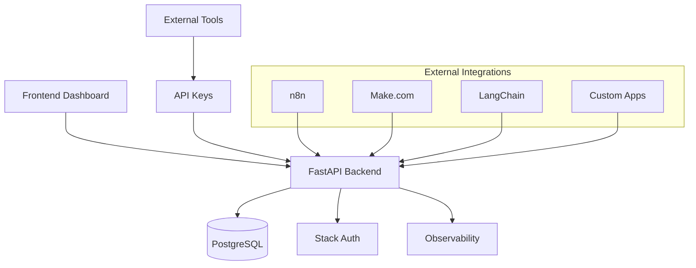

# Introduction to Collexa

Welcome to **Collexa**, the AI Agent Platform that makes it easy to build, deploy, and integrate intelligent agents with your favorite tools and workflows.

## What is Collexa?

Collexa is a production-ready platform for creating and managing AI agents that can be seamlessly integrated with external tools like n8n, Make.com, LangChain, and custom applications. Built with enterprise-grade security and observability, Collexa bridges the gap between AI capabilities and real-world automation.

## Key Features

### 🤖 **Agent Management**
- Create and configure AI agents with simple text descriptions
- Manage multiple agents per organization
- Real-time agent invocation and monitoring

### 🔐 **Enterprise Security**
- Multi-tenant architecture with organization isolation
- API key authentication for external integrations
- Comprehensive audit logging for compliance
- Row-Level Security (RLS) for data protection

### 🔌 **Seamless Integrations**
- **n8n**: Pre-built workflows and HTTP Request nodes
- **Make.com**: Direct API integration scenarios
- **LangChain**: Python SDK integration examples
- **OpenAI**: Compatible API endpoints
- **MCP Protocol**: WebSocket server for AI tool connectivity

### 📊 **Observability & Monitoring**
- Real-time performance metrics and dashboards
- Structured logging with request correlation
- API call analytics and success rate tracking
- Latency monitoring with percentile breakdowns

### 🎯 **Developer Experience**
- RESTful API with comprehensive documentation
- TypeScript SDK and examples
- Interactive API explorer
- Copy-paste integration snippets

## Architecture Overview

## Use Cases

### **Workflow Automation**
Integrate AI agents into your existing automation workflows with n8n or Make.com to add intelligent decision-making and content generation.

### **Custom Applications**
Build AI-powered features into your applications using our REST API and comprehensive SDKs.

### **AI Tool Orchestration**
Use the MCP protocol to connect multiple AI tools and create sophisticated agent workflows.

### **Enterprise AI**
Deploy secure, monitored AI agents with full audit trails and performance analytics for enterprise environments.

## Getting Started

Ready to build your first AI agent? Let's get started:

1. **[Quick Start](./quick-start.md)** - Get up and running in 5 minutes
2. **[Installation](./installation.md)** - Set up your development environment
3. **[First Agent](./first-agent.md)** - Create and test your first agent
4. **[Core Concepts](./concepts.md)** - Understand the platform fundamentals

## Community & Support

- **GitHub**: [UretzkyZvi/collexa](https://github.com/UretzkyZvi/collexa)
- **Issues**: Report bugs and request features
- **Discussions**: Community Q&A and best practices

---

**Next**: [Quick Start Guide →](./quick-start.md)
