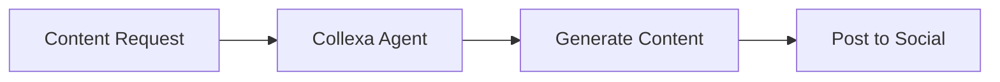
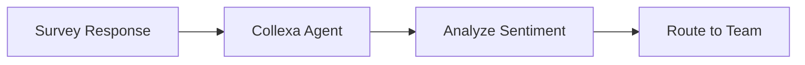
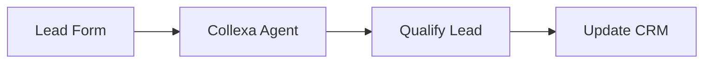

# Make.com Integration

Integrate Collexa agents with Make.com (formerly Integromat) for powerful no-code automation scenarios. This guide covers setup, configuration, and common use cases.

## Overview

Make.com is a visual platform for creating automated workflows between apps and services. With Collexa integration, you can:
- Add AI capabilities to any scenario
- Process data intelligently
- Create sophisticated automation workflows
- Build customer engagement scenarios

## Prerequisites

- Make.com account (free or paid plan)
- Collexa account with at least one agent
- API key for your agent

## Quick Setup

### 1. Get Your API Key

1. Go to **Settings** → **API Keys** in Collexa
2. Select your agent
3. Create a new key with a descriptive name (e.g., "Make.com Production")
4. Copy the key immediately (you won't see it again)

### 2. Create Make.com Scenario

1. Open Make.com and create a new scenario
2. Add an **HTTP** module
3. Configure the module with Collexa settings

### 3. Basic Configuration

**HTTP Module Settings:**
- **URL**: `http://localhost:8000/v1/agents/YOUR_AGENT_ID/invoke`
- **Method**: POST
- **Headers**: 
  - `X-API-Key`: YOUR_API_KEY
  - `Content-Type`: application/json
- **Body Type**: Raw
- **Content Type**: JSON (application/json)

## Detailed Configuration

### HTTP Module Setup

1. **Choose HTTP Module**: Select "Make an HTTP request"
2. **URL Configuration**: 
   ```
   http://localhost:8000/v1/agents/{agent_id}/invoke
   ```
3. **Method**: POST
4. **Headers**:
   ```json
   [
     {
       "name": "X-API-Key",
       "value": "your-api-key-here"
     },
     {
       "name": "Content-Type", 
       "value": "application/json"
     }
   ]
   ```

### Request Body Structure

**Basic Request:**
```json
{
  "capability": "help",
  "input": {
    "question": "{{question}}"
  }
}
```

**Advanced Request with Context:**
```json
{
  "capability": "help",
  "input": {
    "question": "{{question}}",
    "context": {
      "user_id": "{{user_id}}",
      "session_id": "{{session_id}}",
      "timestamp": "{{formatDate(now; 'YYYY-MM-DD HH:mm:ss')}}"
    }
  }
}
```

### Response Handling

Collexa returns structured responses that you can use in subsequent modules:

**Response Structure:**
```json
{
  "agent_id": "agent_abc123",
  "status": "succeeded",
  "run_id": "run_xyz789",
  "result": {
    "response": "Generated response content"
  }
}
```

**Accessing Response Data:**
- Status: `{{status}}`
- Result: `{{result}}`
- Run ID: `{{run_id}}`

## Common Scenarios

### 1. Social Media Content Generation

**Trigger**: New post request
**Process**: Generate engaging content
**Action**: Post to social platforms



**Make.com Scenario:**
1. **Webhook** - Receive content request
2. **HTTP (Collexa)** - Generate content
3. **Router** - Split to multiple platforms
4. **Social Media Modules** - Post to Twitter, LinkedIn, Facebook

**Collexa Request:**
```json
{
  "capability": "generate",
  "input": {
    "content_type": "social_post",
    "topic": "{{topic}}",
    "platform": "{{platform}}",
    "tone": "{{tone}}",
    "hashtags": "{{hashtags}}"
  }
}
```

### 2. Customer Feedback Analysis

**Trigger**: New survey response
**Process**: Analyze sentiment and categorize
**Action**: Route to appropriate team



**Make.com Scenario:**
1. **Google Forms** - New survey response
2. **HTTP (Collexa)** - Analyze feedback
3. **Router** - Route based on sentiment
4. **Email/Slack** - Notify appropriate team

**Collexa Request:**
```json
{
  "capability": "analyze",
  "input": {
    "text": "{{response_text}}",
    "analysis_type": "sentiment_and_category",
    "customer_info": {
      "id": "{{customer_id}}",
      "tier": "{{customer_tier}}"
    }
  }
}
```

### 3. Lead Qualification Workflow

**Trigger**: New lead from form
**Process**: Qualify and score lead
**Action**: Add to CRM with score



**Make.com Scenario:**
1. **Typeform** - New lead submission
2. **HTTP (Collexa)** - Qualify lead
3. **Filter** - Check qualification score
4. **CRM Module** - Add qualified leads

**Collexa Request:**
```json
{
  "capability": "qualify",
  "input": {
    "lead_data": {
      "company": "{{company}}",
      "industry": "{{industry}}",
      "size": "{{company_size}}",
      "budget": "{{budget}}",
      "timeline": "{{timeline}}"
    },
    "qualification_criteria": "enterprise_saas"
  }
}
```

## Advanced Features

### Error Handling

Implement robust error handling in your scenarios:

1. **Error Handler Route**: Add error handling to HTTP module
2. **Filter Module**: Check response status
3. **Notification Module**: Alert on failures

**Error Check Filter:**
```javascript
{{status}} = "failed"
```

**Error Notification:**
```json
{
  "subject": "Collexa Integration Error",
  "message": "Agent {{agent_id}} failed with error: {{error_message}}",
  "run_id": "{{run_id}}"
}
```

### Conditional Logic

Use routers and filters for complex logic:

**Confidence-Based Routing:**
```javascript
{{parseNumber(result.confidence)}} > 0.8
```

**Sentiment-Based Actions:**
```javascript
{{result.sentiment}} = "positive"
```

### Data Transformation

Transform data before sending to Collexa:

**Text Cleaning:**
```javascript
{{replace(replace(input_text; newline; " "); tab; " ")}}
```

**Data Formatting:**
```javascript
{
  "formatted_date": "{{formatDate(created_date; 'YYYY-MM-DD')}}",
  "clean_text": "{{trim(text_input)}}"
}
```

## Environment Management

### Development vs Production

**Development Setup:**
- Use development API keys
- Point to staging Collexa instance
- Enable detailed logging

**Production Setup:**
- Use production API keys
- Point to production Collexa instance
- Implement proper error handling

### Configuration Management

Store configuration in Make.com data stores:

1. **Create Data Store**: Store API keys and URLs
2. **Get Record**: Retrieve configuration
3. **Use in HTTP Module**: Dynamic configuration

**Data Store Structure:**
```json
{
  "environment": "production",
  "api_key": "ak_live_...",
  "base_url": "https://api.yourdomain.com",
  "agent_ids": {
    "support": "agent_support_123",
    "content": "agent_content_456"
  }
}
```

## Monitoring and Debugging

### Execution History

Monitor scenario executions:
1. Check execution history in Make.com
2. Review HTTP request/response details
3. Monitor error rates and patterns

### Collexa Monitoring

Track agent performance:
1. Monitor Collexa dashboard metrics
2. Review execution logs
3. Check API key usage patterns

### Common Issues

**Authentication Failures:**
- Verify API key format
- Check key hasn't been revoked
- Confirm agent ID is correct

**Timeout Issues:**
- Increase HTTP timeout settings
- Check agent performance
- Consider request complexity

**Data Format Errors:**
- Validate JSON structure
- Check required fields
- Verify data types

## Best Practices

### Scenario Design

1. **Modular Design**
   - Break complex scenarios into smaller parts
   - Use sub-scenarios for reusable logic
   - Implement proper error handling

2. **Data Flow**
   - Validate data at each step
   - Transform data appropriately
   - Handle edge cases

### Performance Optimization

1. **Request Efficiency**
   - Minimize payload size
   - Use appropriate timeouts
   - Implement caching where possible

2. **Execution Optimization**
   - Use filters to reduce unnecessary operations
   - Implement parallel processing
   - Monitor execution times

### Security

1. **API Key Management**
   - Store keys in data stores, not directly in modules
   - Use different keys for different environments
   - Rotate keys regularly

2. **Data Protection**
   - Avoid logging sensitive data
   - Implement proper access controls
   - Use HTTPS for all communications

## Example Scenarios

### Complete Customer Support Scenario

**Scenario Structure:**
```json
{
  "name": "AI Customer Support",
  "modules": [
    {
      "name": "Email Trigger",
      "type": "email",
      "settings": {
        "mailbox": "support@company.com"
      }
    },
    {
      "name": "Collexa Analysis",
      "type": "http",
      "settings": {
        "url": "http://localhost:8000/v1/agents/support_agent/invoke",
        "method": "POST",
        "headers": [
          {"name": "X-API-Key", "value": "{{api_key}}"},
          {"name": "Content-Type", "value": "application/json"}
        ],
        "body": {
          "capability": "help",
          "input": {
            "question": "{{body}}",
            "context": {
              "from": "{{from}}",
              "subject": "{{subject}}"
            }
          }
        }
      }
    },
    {
      "name": "Confidence Filter",
      "type": "filter",
      "condition": "{{parseNumber(result.confidence)}} > 0.7"
    },
    {
      "name": "Send Auto-Reply",
      "type": "email",
      "settings": {
        "to": "{{from}}",
        "subject": "Re: {{subject}}",
        "body": "{{result.response}}"
      }
    },
    {
      "name": "Create Ticket",
      "type": "zendesk",
      "settings": {
        "type": "ticket",
        "subject": "{{subject}}",
        "description": "{{body}}",
        "priority": "{{result.priority}}"
      }
    }
  ]
}
```

### Content Generation Pipeline

**Multi-Platform Content Scenario:**
```json
{
  "name": "Multi-Platform Content Generation",
  "modules": [
    {
      "name": "Content Request Webhook",
      "type": "webhook"
    },
    {
      "name": "Generate Content",
      "type": "http",
      "settings": {
        "url": "http://localhost:8000/v1/agents/content_agent/invoke",
        "body": {
          "capability": "generate",
          "input": {
            "topic": "{{topic}}",
            "platforms": ["twitter", "linkedin", "facebook"],
            "tone": "{{tone}}"
          }
        }
      }
    },
    {
      "name": "Platform Router",
      "type": "router",
      "routes": [
        {
          "name": "Twitter",
          "filter": "{{contains(result.platforms; 'twitter')}}"
        },
        {
          "name": "LinkedIn", 
          "filter": "{{contains(result.platforms; 'linkedin')}}"
        }
      ]
    }
  ]
}
```

---

**Next**: [LangChain Integration →](./langchain.md)
