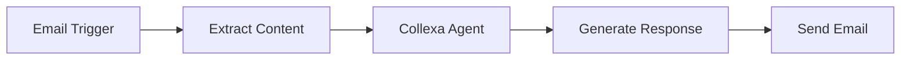
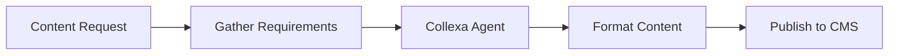
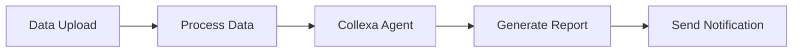

# n8n Integration

Integrate Collexa agents with n8n workflows for powerful visual automation. This guide covers setup, configuration, and common use cases.

## Overview

n8n is a visual workflow automation tool that makes it easy to connect different services. With Collexa integration, you can:
- Add AI capabilities to any workflow
- Process data with intelligent agents
- Create complex automation scenarios
- Build customer service workflows

## Prerequisites

- n8n instance (cloud or self-hosted)
- Collexa account with at least one agent
- API key for your agent

## Quick Setup

### 1. Get Your API Key

1. Go to **Settings** → **API Keys** in Collexa
2. Select your agent
3. Create a new key with a descriptive name (e.g., "n8n Production")
4. Copy the key immediately (you won't see it again)

### 2. Create n8n Workflow

1. Open n8n and create a new workflow
2. Add an **HTTP Request** node
3. Configure the node with Collexa settings

### 3. Basic Configuration

**HTTP Request Node Settings:**
```json
{
  "method": "POST",
  "url": "http://localhost:8000/v1/agents/YOUR_AGENT_ID/invoke",
  "headers": {
    "X-API-Key": "YOUR_API_KEY",
    "Content-Type": "application/json"
  },
  "body": {
    "capability": "help",
    "input": {
      "question": "{{ $json.question }}"
    }
  }
}
```

## Detailed Configuration

### HTTP Request Node Setup

1. **Method**: POST
2. **URL**: `http://localhost:8000/v1/agents/{agent_id}/invoke`
3. **Authentication**: None (using API key in headers)
4. **Headers**:
   - `X-API-Key`: Your Collexa API key
   - `Content-Type`: application/json

### Request Body Structure

**Basic Request:**
```json
{
  "capability": "help",
  "input": {
    "question": "{{ $json.question }}"
  }
}
```

**Advanced Request with Context:**
```json
{
  "capability": "help",
  "input": {
    "question": "{{ $json.question }}",
    "context": {
      "user_id": "{{ $json.user_id }}",
      "session_id": "{{ $json.session_id }}",
      "previous_messages": "{{ $json.history }}"
    }
  }
}
```

### Response Handling

Collexa returns structured responses:
```json
{
  "agent_id": "agent_abc123",
  "status": "succeeded",
  "run_id": "run_xyz789",
  "result": {
    "echo": {
      "capability": "help",
      "input": {
        "question": "How do I reset my password?"
      }
    }
  }
}
```

**Accessing Response Data:**
- Status: `{{ $json.status }}`
- Result: `{{ $json.result }}`
- Run ID: `{{ $json.run_id }}`

## Common Workflows

### 1. Customer Support Automation

**Trigger**: Email received
**Process**: Analyze and generate response
**Action**: Send reply or create ticket



**n8n Workflow:**
1. **Email Trigger** - Monitor support inbox
2. **Extract Data** - Parse email content
3. **HTTP Request** - Call Collexa agent
4. **Condition** - Check if response is confident
5. **Send Email** - Auto-reply or escalate to human

**Collexa Request:**
```json
{
  "capability": "help",
  "input": {
    "question": "{{ $json.email_body }}",
    "context": {
      "customer_email": "{{ $json.from_email }}",
      "subject": "{{ $json.subject }}",
      "urgency": "{{ $json.priority }}"
    }
  }
}
```

### 2. Content Generation Pipeline

**Trigger**: Content request
**Process**: Generate and format content
**Action**: Publish to CMS



**n8n Workflow:**
1. **Webhook Trigger** - Content request received
2. **Data Processing** - Extract requirements
3. **HTTP Request** - Generate content with Collexa
4. **Format Data** - Structure for CMS
5. **CMS API** - Publish content

**Collexa Request:**
```json
{
  "capability": "generate",
  "input": {
    "content_type": "{{ $json.type }}",
    "topic": "{{ $json.topic }}",
    "length": "{{ $json.word_count }}",
    "tone": "{{ $json.tone }}",
    "audience": "{{ $json.target_audience }}"
  }
}
```

### 3. Data Analysis Workflow

**Trigger**: Data upload
**Process**: Analyze and generate insights
**Action**: Send report



**n8n Workflow:**
1. **File Trigger** - New data file uploaded
2. **Read File** - Parse CSV/JSON data
3. **HTTP Request** - Analyze with Collexa
4. **Generate Report** - Format insights
5. **Send Email** - Deliver report

**Collexa Request:**
```json
{
  "capability": "analyze",
  "input": {
    "data": "{{ $json.processed_data }}",
    "analysis_type": "trends",
    "format": "executive_summary"
  }
}
```

## Advanced Features

### Error Handling

Add error handling to your workflows:

1. **HTTP Request Node** - Set "Continue on Fail" to true
2. **IF Node** - Check response status
3. **Error Handling** - Log errors or send notifications

**Error Check Condition:**
```javascript
{{ $json.status !== "succeeded" }}
```

**Error Response Handling:**
```json
{
  "error_type": "{{ $json.error_type }}",
  "error_message": "{{ $json.error_message }}",
  "run_id": "{{ $json.run_id }}",
  "timestamp": "{{ new Date().toISOString() }}"
}
```

### Retry Logic

Implement retry logic for failed requests:

1. **HTTP Request** - Initial attempt
2. **IF Node** - Check if failed
3. **Wait Node** - Delay before retry
4. **HTTP Request** - Retry attempt
5. **Merge Node** - Combine successful responses

### Batch Processing

Process multiple items efficiently:

1. **Split in Batches** - Group items
2. **HTTP Request** - Process each batch
3. **Merge** - Combine results

**Batch Request:**
```json
{
  "capability": "process_batch",
  "input": {
    "items": "{{ $json.batch_items }}",
    "processing_type": "{{ $json.type }}"
  }
}
```

## Environment Configuration

### Development Setup

**Local Development:**
- URL: `http://localhost:8000/v1/agents/{agent_id}/invoke`
- Use development API keys
- Enable detailed logging

### Production Setup

**Production Environment:**
- URL: `https://api.yourdomain.com/v1/agents/{agent_id}/invoke`
- Use production API keys
- Implement proper error handling
- Set up monitoring and alerts

### Environment Variables

Store sensitive data in n8n environment variables:
- `COLLEXA_API_KEY_PROD`
- `COLLEXA_API_KEY_DEV`
- `COLLEXA_BASE_URL`

**Using Environment Variables:**
```json
{
  "headers": {
    "X-API-Key": "{{ $env.COLLEXA_API_KEY_PROD }}",
    "Content-Type": "application/json"
  }
}
```

## Monitoring and Debugging

### Logging

Enable detailed logging in n8n:
1. Set log level to "debug"
2. Monitor execution logs
3. Check HTTP request/response details

### Collexa Monitoring

Monitor your agent performance:
1. Check Collexa dashboard for metrics
2. Review execution logs
3. Monitor API key usage

### Common Issues

**Authentication Errors:**
- Verify API key is correct
- Check key hasn't been revoked
- Ensure agent ID is correct

**Timeout Issues:**
- Increase HTTP request timeout
- Check agent performance
- Consider breaking down complex requests

**Rate Limiting:**
- Implement request delays
- Use batch processing
- Monitor API usage

## Best Practices

### Security

1. **API Key Management**
   - Use environment variables
   - Rotate keys regularly
   - Use different keys for dev/prod

2. **Data Handling**
   - Validate input data
   - Sanitize sensitive information
   - Log appropriately (avoid logging secrets)

### Performance

1. **Request Optimization**
   - Minimize payload size
   - Use appropriate timeouts
   - Implement caching where possible

2. **Workflow Design**
   - Use parallel processing when possible
   - Implement proper error handling
   - Monitor execution times

### Maintenance

1. **Regular Testing**
   - Test workflows regularly
   - Monitor for API changes
   - Update configurations as needed

2. **Documentation**
   - Document workflow purposes
   - Maintain configuration notes
   - Share knowledge with team

## Example Workflows

### Complete Customer Support Workflow

```json
{
  "name": "Customer Support Automation",
  "nodes": [
    {
      "name": "Email Trigger",
      "type": "n8n-nodes-base.emailReadImap",
      "parameters": {
        "mailbox": "INBOX",
        "format": "simple"
      }
    },
    {
      "name": "Collexa Analysis",
      "type": "n8n-nodes-base.httpRequest",
      "parameters": {
        "method": "POST",
        "url": "http://localhost:8000/v1/agents/support_agent/invoke",
        "headers": {
          "X-API-Key": "{{ $env.COLLEXA_API_KEY }}",
          "Content-Type": "application/json"
        },
        "body": {
          "capability": "help",
          "input": {
            "question": "{{ $json.text }}",
            "context": {
              "from": "{{ $json.from.value[0].address }}",
              "subject": "{{ $json.subject }}"
            }
          }
        }
      }
    },
    {
      "name": "Send Response",
      "type": "n8n-nodes-base.emailSend",
      "parameters": {
        "to": "{{ $('Email Trigger').item.json.from.value[0].address }}",
        "subject": "Re: {{ $('Email Trigger').item.json.subject }}",
        "text": "{{ $json.result.response }}"
      }
    }
  ]
}
```

---

**Next**: [Make.com Integration →](./make-com.md)
