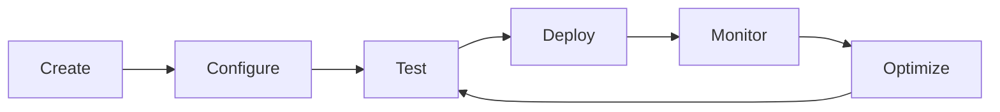

# Agent Management

Learn how to create, configure, and manage your AI agents effectively.

## Agent Overview

### What is an Agent?

An **Agent** in Collexa is an AI-powered entity that:
- Has a specific purpose defined by your brief
- Can perform multiple capabilities (functions)
- Maintains context and personality
- Integrates with external tools via API

### Agent Lifecycle



## Creating Agents

### Via Dashboard

1. **Navigate to Agents Page**
   - Click "Agents" in the sidebar
   - Click "Create New Agent" button

2. **Enter Agent Brief**
   ```
   Example: A customer support assistant for an e-commerce platform. 
   It should help customers with order inquiries, product questions, 
   returns, and basic troubleshooting. The agent should be friendly, 
   professional, and provide clear step-by-step guidance.
   ```

3. **Review Generated Agent**
   - System generates unique Agent ID
   - Display name is created from brief
   - Agent is immediately available

### Via API

```bash
curl -X POST http://localhost:8000/v1/agents \
  -H "Authorization: Bearer your-token" \
  -H "X-Team-Id: your-org-id" \
  -H "Content-Type: application/json" \
  -d '{
    "brief": "A customer support assistant for an e-commerce platform..."
  }'
```

## Agent Properties

### Core Information

- **Agent ID**: Unique identifier (e.g., `agent_abc123`)
- **Display Name**: Human-readable name
- **Brief**: Original description of the agent's purpose
- **Created Date**: When the agent was created
- **Organization**: Which org the agent belongs to

### Capabilities

Every agent includes these default capabilities:

| Capability | Purpose | Example Input |
|------------|---------|---------------|
| `help` | General assistance | `{"question": "How do I...?"}` |
| `echo` | Testing/debugging | `{"test": "any data"}` |
| `status` | Health check | `{}` |

## Managing Agents

### Agents List View

The agents page shows:
- **Card Layout**: Visual grid of all your agents
- **Agent Details**: Name, ID, and creation date
- **Quick Actions**: View, Instructions, and management buttons
- **Empty State**: Helpful guidance when no agents exist

### Agent Actions

#### View Agent Details
- Click "View" button on any agent card
- Shows complete agent information
- Displays recent invocation history
- Links to related logs and metrics

#### Get Instructions
- Click "Instructions" button
- Access integration code snippets
- Copy-paste examples for n8n, Make.com, etc.
- API documentation specific to this agent

#### Agent Settings
- Access via agent details page
- Modify agent configuration
- Update display name or brief
- Manage agent-specific settings

## Agent Cards Interface

### Card Information Display

Each agent card shows:
- **Agent Name**: Display name or "Unnamed Agent"
- **Agent ID**: Unique identifier in monospace font
- **Creation Date**: When the agent was created
- **Action Buttons**: View and Instructions links

### Visual States

- **Normal**: Standard card with white background
- **Hover**: Subtle shadow effect for interactivity
- **Loading**: Skeleton placeholders during data fetch
- **Error**: Error message with retry option

## Testing Agents

### Playground Testing

1. **Navigate to Playground**
   - Select your agent from dropdown
   - Choose capability to test
   - Enter test input data

2. **Example Test Cases**

   **Help Capability:**
   ```json
   {
     "capability": "help",
     "input": {
       "question": "How do I track my order?",
       "context": {
         "user_type": "premium",
         "order_id": "ORD-12345"
       }
     }
   }
   ```

   **Echo Capability (Testing):**
   ```json
   {
     "capability": "echo",
     "input": {
       "test_data": "Hello World",
       "timestamp": "2025-01-18T10:00:00Z"
     }
   }
   ```

### API Testing

```bash
# Test help capability
curl -X POST http://localhost:8000/v1/agents/agent_abc123/invoke \
  -H "X-API-Key: your-api-key" \
  -H "Content-Type: application/json" \
  -d '{
    "capability": "help",
    "input": {
      "question": "How do I reset my password?"
    }
  }'

# Test echo capability
curl -X POST http://localhost:8000/v1/agents/agent_abc123/invoke \
  -H "X-API-Key: your-api-key" \
  -H "Content-Type: application/json" \
  -d '{
    "capability": "echo",
    "input": {
      "test": "integration working"
    }
  }'
```

## Agent Performance

### Monitoring Agent Health

Track your agent's performance through:
- **Dashboard Metrics**: Overall invocation count and success rate
- **Logs Page**: Detailed execution history
- **Individual Agent Views**: Agent-specific analytics

### Performance Indicators

**Healthy Agent:**
- Consistent response times
- High success rate (>95%)
- Clear, helpful responses
- No recurring errors

**Performance Issues:**
- Slow response times (>5 seconds)
- High error rate
- Inconsistent or unclear responses
- Frequent timeouts

## Best Practices

### Agent Creation

1. **Clear Purpose**: Write specific, detailed briefs
2. **Descriptive Names**: Use meaningful display names
3. **Test Early**: Validate functionality before integration
4. **Document Usage**: Keep track of agent purposes and use cases

### Agent Organization

1. **Naming Convention**: Use consistent naming patterns
2. **Purpose Grouping**: Group related agents logically
3. **Environment Separation**: Use different orgs for dev/prod
4. **Regular Cleanup**: Remove unused or test agents

### Testing Strategy

1. **Capability Testing**: Test each capability individually
2. **Edge Cases**: Test with unusual or empty inputs
3. **Error Scenarios**: Verify error handling
4. **Performance Testing**: Monitor response times under load

## Troubleshooting

### Agent Creation Issues

**Problem**: Agent creation fails
**Solutions**:
- Verify you're logged in and have selected an organization
- Check that your brief is not empty
- Ensure you have permission to create agents
- Try refreshing the page and attempting again

### Agent Not Responding

**Problem**: Agent invocations fail or timeout
**Solutions**:
- Check the Logs page for error details
- Verify your API key is correct and not revoked
- Test with the echo capability first
- Check network connectivity

### Missing Agents

**Problem**: Agents don't appear in the list
**Solutions**:
- Verify you're in the correct organization
- Check if agents were created in a different org
- Refresh the page to reload data
- Check browser console for errors

## Advanced Features

### Agent Instructions

Each agent provides integration instructions:
- **API Examples**: Ready-to-use code snippets
- **Authentication**: Proper API key usage
- **Error Handling**: How to handle failures
- **Best Practices**: Optimization tips

### Integration Patterns

Common ways to use agents:
- **Workflow Automation**: n8n, Make.com, Zapier
- **Custom Applications**: Direct API integration
- **Chatbots**: Real-time conversation interfaces
- **Batch Processing**: Bulk data processing

---

**Next**: [API Key Management →](./api-keys.md)
